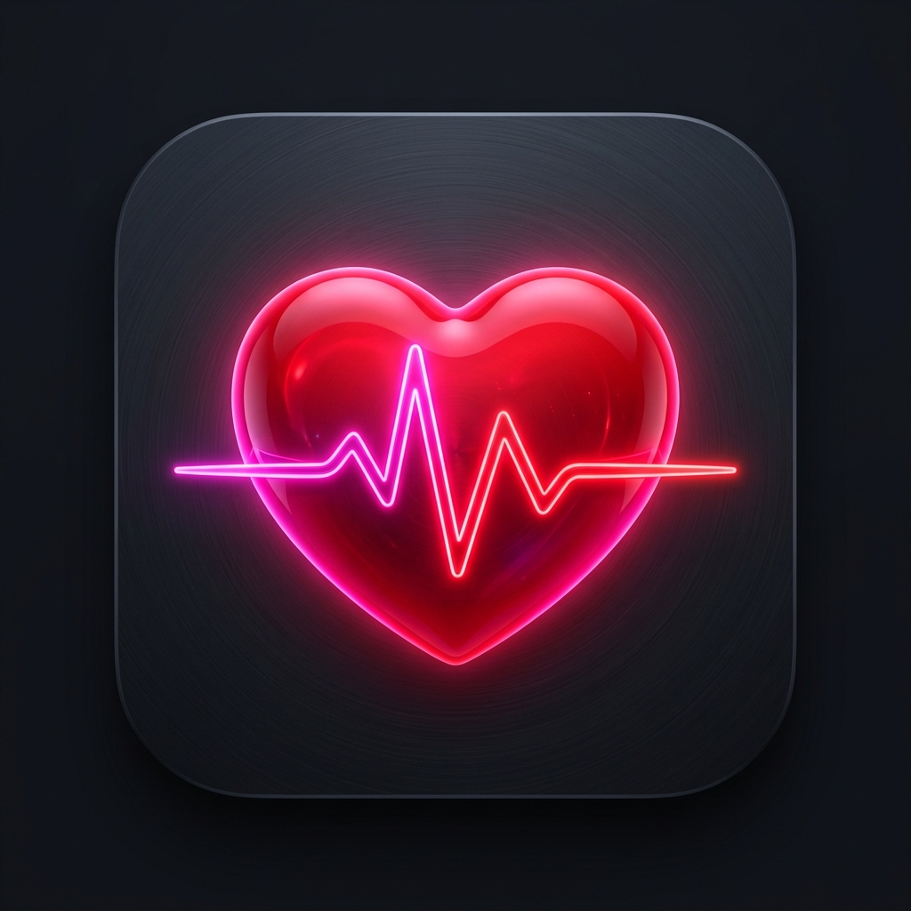

# PulseTrack — rPPG Health Monitoring System

<p align="center">
  
</p>

<p align="center">
  <strong>Contactless heart rate monitoring powered by remote Photoplethysmography (rPPG)</strong>
</p>

<p align="center">
  
  
  
  
  
  
</p>

---

## 📋 Table of Contents

- [Overview](#overview)
- [How rPPG Works](#how-rppg-works)
- [Architecture](#architecture)
- [Tech Stack](#tech-stack)
- [Features](#features)
- [Project Structure](#project-structure)
- [Getting Started](#getting-started)
- [API Reference](#api-reference)
- [Signal Processing Pipeline](#signal-processing-pipeline)
- [Scientific References](#scientific-references)
- [Security](#security)
- [Disclaimer](#disclaimer)

---

## Overview

PulseTrack is a cross-platform mobile application that measures heart rate, HRV (Heart Rate Variability), stress levels, and estimated SpO2/blood pressure using only the smartphone's front-facing camera — no wearable devices or sensors required.

The system uses **rPPG (remote Photoplethysmography)**, a technique that detects subtle color changes in facial skin caused by blood flow with each heartbeat. These micro-variations in the green channel of video frames are processed through a scientific signal processing pipeline to extract vital signs.

---

## How rPPG Works

Remote Photoplethysmography detects the cardiac pulse by analyzing tiny color fluctuations in facial skin captured by a standard RGB camera:

1. **Blood Volume Changes** — Each heartbeat pumps blood through facial blood vessels, causing imperceptible skin color changes
2. **Green Channel Dominance** — The green wavelength (~520nm) is most strongly absorbed by hemoglobin, making it the optimal channel for pulse detection (Verkruysse et al., 2008)
3. **Signal Extraction** — RGB averages from facial ROIs (forehead + cheeks) are collected at ~30 FPS
4. **Frequency Analysis** — Butterworth bandpass filtering (0.7–4.0 Hz) isolates the cardiac frequency, and FFT identifies the dominant pulse frequency
5. **BPM Calculation** — `BPM = dominant_frequency × 60`

```
┌────────────┐    ┌──────────┐    ┌─────────┐    ┌──────────┐    ┌─────┐
│   Camera   │───▶│   Face   │───▶│   ROI   │───▶│   RGB    │───▶│ BPM │
│   Frames   │    │Detection │    │ Extract │    │ Process  │    │     │
└────────────┘    └──────────┘    └─────────┘    └──────────┘    └─────┘
     30 FPS        ML Kit          Forehead      Bandpass+FFT    60-100
                   FaceMesh        + Cheeks       0.7-4.0 Hz      BPM
```

---

## Architecture

PulseTrack uses a **three-tier architecture** with clear separation of concerns:

```
┌──────────────────────────────────────────────────────┐
│                  FLUTTER APP (Client)                 │
│                                                       │
│  ┌─────────┐  ┌────────────┐  ┌───────────────────┐  │
│  │ Camera  │─▶│  ML Kit    │─▶│ ROI Extraction    │  │
│  │ Capture │  │  Face Det. │  │ (Forehead+Cheeks) │  │
│  └─────────┘  └────────────┘  └────────┬──────────┘  │
│                                        │              │
│  ┌─────────────────────────────────────▼───────────┐  │
│  │         RppgService (Signal Buffer)             │  │
│  │   Collects RGB channel averages at ~30 FPS      │  │
│  └─────────────────────┬───────────────────────────┘  │
│                        │                              │
│  ┌─────────────────────▼───────────────────────────┐  │
│  │      RppgBackendService (HTTP Client)           │  │
│  │   POST /api/rppg/analyze → Python Backend       │  │
│  │   Fallback: On-device peak detection            │  │
│  └─────────────────────┬───────────────────────────┘  │
│                        │                              │
│  ┌─────────────────────▼───────────────────────────┐  │
│  │   HealthProvider (State Management - Provider)  │  │
│  └─────────────────────┬───────────────────────────┘  │
│                        │                              │
│  ┌─────────────────────▼───────────────────────────┐  │
│  │              UI Screens (26 screens)             │  │
│  │   Home │ Scan │ Results │ History │ Profile      │  │
│  └─────────────────────────────────────────────────┘  │
└───────────┬──────────────────────────┬────────────────┘
            │                          │
            ▼                          ▼
┌───────────────────────┐   ┌──────────────────────────┐
│  PYTHON BACKEND       │   │  NODE.JS BACKEND         │
│  (Signal Processing)  │   │  (Data & Auth)           │
│                       │   │                          │
│  FastAPI + Uvicorn    │   │  Express.js              │
│  ┌─────────────────┐  │   │  ┌─────────────────────┐ │
│  │ Normalize       │  │   │  │ Auth (Register,     │ │
│  │ Detrend         │  │   │  │  Login, OTP, 2FA)   │ │
│  │ Bandpass Filter │  │   │  ├─────────────────────┤ │
│  │ FFT Analysis    │  │   │  │ BPM Records (CRUD)  │ │
│  │ Peak Detection  │  │   │  ├─────────────────────┤ │
│  │ HRV Analysis    │  │   │  │ Breathing Records   │ │
│  │ Stress Scoring  │  │   │  ├─────────────────────┤ │
│  │ SpO2 Estimation │  │   │  │ Health Goals        │ │
│  │ BP Estimation   │  │   │  ├─────────────────────┤ │
│  └─────────────────┘  │   │  │ Profile / Images    │ │
│                       │   │  └─────────┬───────────┘ │
│  Port: 8000           │   │  Port: 5000│             │
└───────────────────────┘   └────────────┼─────────────┘
                                         ▼
                            ┌──────────────────────────┐
                            │     MongoDB Atlas         │
                            │  ┌────────┐ ┌──────────┐ │
                            │  │ Users  │ │BpmRecords│ │
                            │  └────────┘ └──────────┘ │
                            │  ┌────────────────────┐   │
                            │  │ BreathingRecords   │   │
                            │  └────────────────────┘   │
                            └──────────────────────────┘
```

> See [ARCHITECTURE.md](ARCHITECTURE.md) for detailed component-level documentation.

---

## Tech Stack

| Layer | Technology | Purpose |
|-------|-----------|---------|
| **Mobile App** | Flutter 3.24+ / Dart 3.4+ | Cross-platform UI |
| **Face Detection** | Google ML Kit (FaceDetection) | Real-time face tracking + ROI |
| **State Management** | Provider | Reactive UI updates |
| **Signal Processing** | Python 3.11 / FastAPI | Butterworth filter, FFT, HRV |
| **Scientific Computing** | NumPy, SciPy, MediaPipe | Signal analysis + face mesh |
| **API Backend** | Node.js / Express.js | Auth, data persistence |
| **Database** | MongoDB Atlas (Mongoose) | User profiles, health records |
| **Auth** | Firebase Auth + Custom OTP | Multi-factor authentication |
| **AI Assistant** | Google Gemini API | Personalized health insights |
| **Deployment** | Render (Node.js) | Cloud hosting |

---

## Features

### Core Health Monitoring
- 📷 **Contactless BPM** — Heart rate from front camera using rPPG
- 📊 **HRV Analysis** — RMSSD, SDNN, pNN50 metrics
- 🧠 **Stress Estimation** — Composite score from HRV + BPM
- 💨 **SpO2 Estimation** — Camera-based oxygen saturation (non-medical)
- 🩸 **BP Estimation** — Estimated blood pressure (non-medical)
- 🎯 **Confidence Score** — SNR-based signal quality indicator

### AI & Analytics
- 🤖 **Gemini AI Chatbot** — Ask questions about your health data
- 📈 **AI Health Insights** — Personalized analysis after each scan
- 📉 **Trend Tracking** — Historical BPM/SpO2/BP charts
- 🏆 **Daily Goals** — Scan and breathing exercise targets
- 🔥 **Streak System** — Consistency tracking

### Wellness
- 🌬️ **Breathing Exercises** — Guided box breathing
- 😴 **Sleep Tracking** — Sleep quality logging
- 📄 **PDF Reports** — Export health data

### Security & UX
- 🔐 **Secure Auth** — Firebase + OTP + 2FA
- 🔑 **No Hardcoded Secrets** — Environment variable management
- 🌙 **Premium Dark Mode** — Glassmorphic UI design
- 📱 **Offline Support** — Local data caching

---

## Project Structure

```
pulse-track-app/
├── lib/                          # Flutter application source
│   ├── main.dart                 # App entry point (dotenv + Firebase init)
│   ├── models/
│   │   ├── bpm_record.dart       # Health record model (BPM, HRV, stress, SpO2)
│   │   └── user_model.dart       # User profile model
│   ├── providers/
│   │   ├── auth_provider.dart    # Authentication state
│   │   └── health_provider.dart  # Health data state (records, history)
│   ├── screens/                  # 26 UI screens
│   │   ├── home_screen.dart      # Dashboard with real-time vitals
│   │   ├── scan_screen.dart      # Camera-based rPPG scanning
│   │   ├── result_screen.dart    # Scan results + AI analysis
│   │   ├── history_screen.dart   # Historical health records
│   │   ├── ai_chat_screen.dart   # Gemini AI health chatbot
│   │   ├── breathing_screen.dart # Guided breathing exercises
│   │   └── ...                   # Profile, settings, auth screens
│   ├── services/
│   │   ├── rppg_service.dart     # Signal buffer + analysis orchestrator
│   │   ├── rppg_backend_service.dart  # Python backend HTTP client
│   │   ├── ai_advice_service.dart     # Gemini AI integration (dotenv keys)
│   │   └── api_service.dart      # Node.js backend API client
│   ├── theme/
│   │   └── app_theme.dart        # Dark theme + design tokens
│   └── utils/
│       └── pdf_generator.dart    # Health report PDF export
│
├── python_backend/               # Signal processing microservice
│   ├── app.py                    # FastAPI server (POST /api/rppg/analyze)
│   ├── signal_processing.py      # Bandpass filter, FFT, BPM, SpO2, BP
│   ├── hrv_analysis.py           # RMSSD, SDNN, pNN50, stress estimation
│   ├── face_detection.py         # MediaPipe FaceMesh ROI extraction
│   ├── models.py                 # Pydantic request/response schemas
│   └── requirements.txt          # Python dependencies
│
├── backend/                      # Node.js REST API
│   ├── index.js                  # Express server entry
│   ├── config/db.js              # MongoDB connection
│   ├── controllers/
│   │   ├── authController.js     # Auth (register, login, OTP, 2FA)
│   │   ├── bpmController.js      # BPM record CRUD + streak logic
│   │   └── breathingController.js
│   ├── models/
│   │   ├── User.js               # User schema (Mongoose)
│   │   ├── BpmRecord.js          # Health record schema
│   │   └── BreathingRecord.js
│   ├── routes/                   # API route definitions
│   └── .env                      # Server environment variables
│
├── .env                          # Flutter environment (GEMINI_API_KEY)
├── .gitignore                    # Excludes .env, __pycache__, etc.
├── pubspec.yaml                  # Flutter dependencies
├── ARCHITECTURE.md               # Detailed architecture documentation
└── README.md                     # This file
```

---

## Getting Started

### Prerequisites

- Flutter SDK 3.24+
- Dart SDK 3.4+
- Python 3.10+
- Node.js 18+
- MongoDB Atlas account (or local MongoDB)
- Android device/emulator with camera access

### 1. Clone the Repository

```bash
git clone https://github.com/VenkataReddy2006/pulse-track-app.git
cd pulse-track-app
```

### 2. Configure Environment Variables

```bash
# Flutter app (.env at project root)
cp .env.example .env
# Edit .env and add your Gemini API key:
#   GEMINI_API_KEY=your_key_from_aistudio_google_com

# Node.js backend (backend/.env)
# Already configured — update MongoDB URI and secrets as needed
```

### 3. Start the Python Signal Processing Backend

```bash
cd python_backend
pip install -r requirements.txt
uvicorn app:app --host 0.0.0.0 --port 8000 --reload
```

Verify it's running:
```bash
curl http://localhost:8000/api/rppg/health
# → {"status":"ok","service":"pulsetrack-rppg-backend","version":"1.0.0"}
```

### 4. Start the Node.js Backend

```bash
cd backend
npm install
npm run dev
```

### 5. Run the Flutter App

```bash
flutter pub get
flutter run
```

---

## API Reference

### Python Backend — Signal Processing

| Method | Endpoint | Description |
|--------|----------|-------------|
| `GET` | `/api/rppg/health` | Health check |
| `POST` | `/api/rppg/analyze` | Analyze RGB signals → returns BPM, HRV, stress, SpO2, BP |

**POST /api/rppg/analyze** — Request:
```json
{
  "red_signals": [142.5, 143.1, ...],
  "green_signals": [128.3, 127.9, ...],
  "blue_signals": [98.7, 99.2, ...],
  "timestamps_ms": [1715500000, 1715500033, ...],
  "sample_rate": 30.0
}
```

**Response:**
```json
{
  "success": true,
  "bpm": 72,
  "bpm_raw": 72.34,
  "confidence": 0.78,
  "spo2_estimated": 97,
  "systolic_estimated": 120,
  "diastolic_estimated": 78,
  "hrv": {
    "rmssd_ms": 42.5,
    "sdnn_ms": 38.7,
    "pnn50_percent": 18.3,
    "mean_rr_ms": 833.2
  },
  "stress": {
    "level": "Relaxed",
    "score": 0.25,
    "description": "Your HRV indicates good parasympathetic activity."
  },
  "dominant_frequency_hz": 1.2057,
  "signal_quality": "Good",
  "samples_used": 450
}
```

### Node.js Backend — Data & Auth

| Method | Endpoint | Description |
|--------|----------|-------------|
| `POST` | `/api/auth/register` | User registration |
| `POST` | `/api/auth/login` | User login |
| `POST` | `/api/auth/send-otp` | Send OTP for email verification |
| `POST` | `/api/auth/verify-otp` | Verify OTP code |
| `POST` | `/api/bpm/add` | Save a BPM record |
| `GET` | `/api/bpm/history/:userId` | Get user's scan history |
| `GET` | `/api/bpm/latest/:userId` | Get most recent scan |
| `GET` | `/api/bpm/stats/:userId` | Get aggregate stats |
| `POST` | `/api/breathing/add` | Save breathing exercise record |

---

## Signal Processing Pipeline

Detailed processing steps performed by the Python backend:

```
Input: RGB signal arrays (300-450 samples at ~30 FPS)
  │
  ▼
┌─────────────────────────────────────────┐
│ 1. GREEN CHANNEL EXTRACTION             │
│    Verkruysse (2008): Green wavelength   │
│    (~520nm) has strongest hemoglobin     │
│    absorption for rPPG                   │
└───────────────────┬─────────────────────┘
                    ▼
┌─────────────────────────────────────────┐
│ 2. MOTION ARTIFACT DETECTION            │
│    Windowed variance analysis           │
│    Reject frames with >3x global var    │
│    Minimum 40% clean frames required    │
└───────────────────┬─────────────────────┘
                    ▼
┌─────────────────────────────────────────┐
│ 3. SMOOTHING                            │
│    Moving average filter (window=3)     │
│    Reduces high-frequency noise         │
└───────────────────┬─────────────────────┘
                    ▼
┌─────────────────────────────────────────┐
│ 4. NORMALIZATION                        │
│    Zero-mean, unit-variance             │
│    Standardizes across lighting/skin    │
└───────────────────┬─────────────────────┘
                    ▼
┌─────────────────────────────────────────┐
│ 5. DETRENDING                           │
│    Linear detrend (scipy.signal)        │
│    Removes slow baseline drift          │
└───────────────────┬─────────────────────┘
                    ▼
┌─────────────────────────────────────────┐
│ 6. BUTTERWORTH BANDPASS FILTER          │
│    3rd-order, 0.7-4.0 Hz               │
│    (42-240 BPM physiological range)     │
│    Zero-phase filtfilt for no lag       │
└───────────────────┬─────────────────────┘
                    ▼
┌─────────────────────────────────────────┐
│ 7. FFT FREQUENCY ANALYSIS              │
│    scipy.fft.rfft → power spectrum      │
│    Find peak frequency in 0.7-4.0 Hz   │
│    BPM = peak_frequency × 60           │
└───────────────────┬─────────────────────┘
                    ▼
┌─────────────────────────────────────────┐
│ 8. SIGNAL QUALITY (SNR)                 │
│    Signal power at peak / total power   │
│    Confidence: 0.0 (poor) → 1.0 (good) │
└───────────────────┬─────────────────────┘
                    ▼
┌─────────────────────────────────────────┐
│ 9. HRV ANALYSIS                         │
│    Peak detection → RR intervals        │
│    RMSSD, SDNN, pNN50 calculation       │
│    Stress: composite(HRV, BPM)          │
└───────────────────┬─────────────────────┘
                    ▼
┌─────────────────────────────────────────┐
│ 10. ESTIMATED VITALS (non-medical)      │
│    SpO2: Red/Blue ratio-of-ratios       │
│    BP: BPM + HRV correlation model      │
└─────────────────────────────────────────┘
```

---

## Scientific References

| Paper | Year | Contribution |
|-------|------|-------------|
| Verkruysse, Svaasand & Nelson | 2008 | Established green channel superiority for rPPG |
| Poh, McDuff & Picard | 2010 | Non-contact cardiac pulse via video + blind source separation |
| Kong et al. | 2013 | Camera-based SpO2 estimation using visible light |
| Shaffer & Ginsberg | 2017 | HRV metrics overview and clinical norms |
| de Haan & Jeanne | 2013 | Robust pulse-rate from chrominance-based rPPG |

---

## Security

- ✅ **No hardcoded API keys** — All secrets loaded from `.env` via `flutter_dotenv`
- ✅ **`.env` gitignored** — Environment files excluded from version control
- ✅ **OTP verification** — Email-based verification for new accounts
- ✅ **2FA support** — Optional two-factor authentication
- ✅ **Password hashing** — bcrypt for server-side password storage

---

## Disclaimer

> **⚠️ PulseTrack is for informational and educational purposes only.**
>
> This application is **NOT a medical device** and has not been cleared by the FDA or any regulatory body. The measurements provided (BPM, SpO2, blood pressure, HRV, stress) are **estimates** derived from camera-based signal processing and should **NOT** be used for medical diagnosis, treatment, or monitoring.
>
> SpO2 and blood pressure readings are clearly labeled as **"Estimated (non-medical)"** in the app. For accurate medical measurements, always use certified medical devices and consult a healthcare professional.

---

## License

This project is licensed under the MIT License.

---

<p align="center">
  Built with ❤️ using Flutter, FastAPI, and real signal processing
</p>
